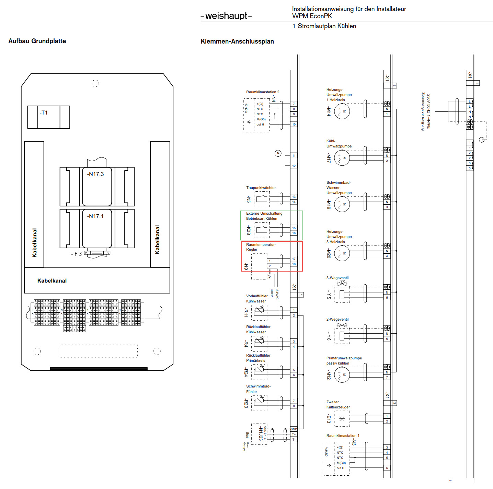

# WeishauptWärmepumpenStatus
Lösung zur Kommunikation des Wärmepumpenstatus Heizen/Kühlen an entfernte (remote) Heizkreisverteiler.
Entwickelt für die folgende Situation:
Ein Wohn- und Geschäftshaus mit ca. 40 Einheiten deckt über Geothermie-Erdwärmesonden einen Teil des Heizbedarfs. Hierfür ist eine Weishaupt WWP S 50 eingebaut, die für die Sommerperiode über einen Kühlmodus verfügt. Im Kühlmodus wird kaltes Wasser (ca. 15-20 °C) durch die Fussbodenheizungen gepumpt. Dadurch gibt es eine kostenlose Raumkühlung und das Erdreich wird regeneriert.

Damit die Kühlung funktioniert, müssen die Raumtemperaturfühler in den angeschlossenen Nutzungseinheiten umgestellt werden, denn im Sommer müssen diese ja die Ventile in der Heizkreisverteilern dann öffnen, wenn es wärmer als gewünscht ist. Also genau andersherum als im Winter, wenn die Ventile geöffnet werden müssen, wenn es kälter als gewünscht ist.

Für diese Umstellung muss ein Signal von der Wärmepumpe an alle Heizkreisverteiler bzw. Raumtemperaturregler gesendet werden. Die Wärmepumpe hat dafür einen potentialfreien Ausgang am "Weishaupt Erweiterungsmodul für Passive Kühlung WPM EconPK" - es sind die Klemmen X1.3 17+18 (siehe roter Kasten; keine Gewährleistung, Anschluss auf eigenes Risiko, denn bei uns hat das der Weishaupt-Techniker gemacht):

Die Heizkreisverteiler haben dafür einen potentialfreien Eingang (CO = "Cooling").

Die Lösung hierfür besteht aus den folgenden Komponenten:
# 1. WPStatusUploader:
   
Ein Raspberry Pi, der alle 8 Stunden den Status des Signals der Wärmepumpe abfragt und das Ergebnis an einen Webserver sendet. Programmiert als .NET 8.0 Konsolen-App, Teilprojekt WaermepumpenUpload. Abgesichert durch SSL mit Certificate Pinning, d.h. der Server nimmt nur Anfragen von Clients an, die sich mit einem Zertifikat ausweisen können.

Setup des Raspberry Pi für .NET 8: siehe https://www.petecodes.co.uk/install-and-use-microsoft-dot-net-8-with-the-raspberry-pi/

Aus VS2022 direkt auf den Raspberry Pi publishen mit Erweiterung Linux Debugger: https://marketplace.visualstudio.com/items?itemName=SuessLabs.VSLinuxDebugger

Das Programm WPStatusUpload per Cron Job alle 8 Stunden ausführen lassen:

`crontab -e
0 */8 * * * /home/username/.dotnet/dotnet /home/username/WPStatusUploader/WPStatusUploader.dll >/home/username/cronlog.log 2>&1 `

# 2. WPStatusUploadServer:
   
Ein Webserver, der den Request des Raspberry Pi entgegen nimmt, in einer SQL-Server-Datenbank speichert und bei einer Änderung im Vergleich zum vorherigen Wert Benachrichtigungs-Mails versendet. Programmiert als .NET 8.0 ASP.NET Core-Web-API (Minimal API). Die letzten 8 Statusergebnisse werden in eine JSON-Datei geschrieben. Sollte durch Certificate Pinning abgesichert werden - siehe https://medium.com/@yildirimabdrhm/configuring-iis-for-client-certificate-mapping-authentication-d7f707506a97

Der Application Pool unter IIS muss Schreibrechte auf die Datei wpstatus.json im Verzeichnis der statischen Website (siehe unten) haben.

# 3. WPstatusStaticWebsite:

Eine statische Website (https://waermepumpe.xyz.de), die die Daten aus der JSON-Datei mit Javascipt ausliest und formatiert anzeigt

# 4. WPStatusHKVSet:

Pro Heizkreisverteiler ein Minicomputer ESP01 mit Relais, das alle 8 Stunden den Inhalt der JSON-Datei aus der statischen Website lädt und dementsprechend durch Schaltung des Relais den CO-Modus des Heizkreisverteilers ein- bzw. ausschaltet.
  
Statt Komponente 4 kann "Low-Tech" auch einfach ein Ein-/Aus-Schalter an den CO-Eingang des Heizkreisverteilers angeschlossen werden und die Nutzer schalten nach Eingang der Benachrichtigungsmails manuell um.
